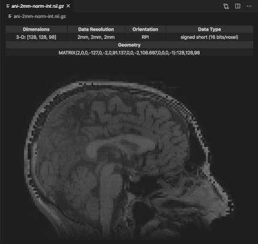

# neuro-viewer

If you got here, you might be familiar with Nifti files. In any case, 

## Features

A quick way to view your Nifti files. It shows some metadata and renders a volume!



## Known Issues

* Does not display other axis
* Does not handle 4D data
* Some data preprocessing might be required to work at the moment:

```
data /= data.max()
data *= 255
```

## Release Notes

### 0.0.1

New extension on the block.
